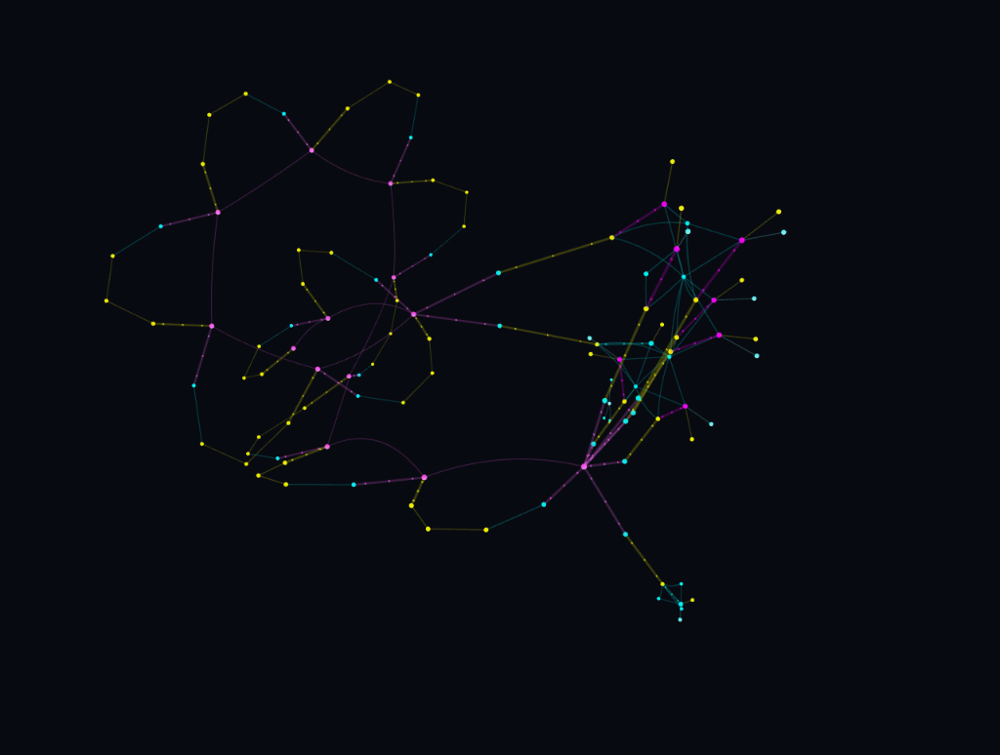

# Math Explorer 3D & RRSI Autonomous Agent Harness

High-speed mathematical exploration harness combining ultra-fast System One routing, vectorless hierarchical literature retrieval, local specialized reasoning on Apple Silicon, frontier deep reasoning, and recursive self-improvement.


<p align="center">
  
  <br>
  <em>Interactive 3D WebGL topological knowledge graph of mathematical proofs, lemmata, SMT counterexamples, and RRSI evolution states.</em>
</p>

---

## 🏛️ Architecture Overview

```
                          [ User Question / Conjecture ]
                                        │
                                        ▼
             ┌─────────────────────────────────────────────────────┐
             │       Tier 1: TypeSafe JEV System One Triage        │
             │   (<100ms Domain, Difficulty, arXiv Need, Gating)   │
             └──────────────────────────┬──────────────────────────┘
                                        │
              ┌─────────────────────────┴────────────────────────┐
              ▼                                                  ▼
 ┌─────────────────────────┐                        ┌─────────────────────────┐
 │   Tier 2: Literature    │                        │    Direct Execution     │
 │  (arXiv + PageIndex)    │                        │  (No context required)  │
 └────────────┬────────────┘                        └────────────┬────────────┘
              └─────────────────────────┬────────────────────────┘
                                        │
             ┌──────────────────────────┴──────────────────────────┐
             │            Multi-Tier Solver Dispatch               │
             ├──────────────────────────┬──────────────────────────┤
             │  Tier 3: Local Violetto  │   Tier 4: Codex Astra    │
             │  (Limite 1B on MPS)      │   (gpt-6-astra xhigh)    │
             └──────────────────────────┴──────────────────────────┘
                                        │
                                        ▼
             ┌─────────────────────────────────────────────────────┐
             │       Tier 5: JEV Confidence & Rigor Gating         │
             └──────────────────────────┬──────────────────────────┘
                                        │
                                        ▼
             ┌─────────────────────────────────────────────────────┐
             │       3D Knowledge Graph & RRSI Evolution Engine    │
             │       (arXiv:2609.24972 Regularized Mutations)      │
             └─────────────────────────────────────────────────────┘
```

### Core Components

1. **TypeSafe JEV (<100ms System One Router)**
   - Pre-reasoning intent triage: domain classification, difficulty scoring `[0, 4]`, and literature need probability.
   - Post-reasoning verification: mathematical plausibility and formal rigor evaluation.
   - Authenticates via `~/.typesafe_key` or `TYPESAFE_API_KEY`.

2. **VectifyAI / PageIndex (Vectorless Tree Hierarchy)**
   - Eliminates expensive vector databases and flat chunk embeddings.
   - Parses mathematical documents and PDFs into semantic document tree hierarchies.
   - Prunes and selects relevant lemmata and theorems via JEV scoring.

3. **Limite 1B Violetto (Apple Silicon MPS)**
   - Specialized math reasoning model (`paradigma-inc/limite-1b-violetto`) running locally via PyTorch MPS in `bfloat16`.
   - Optimized sampling with stabilized top-50 token pruning.

4. **OpenAI Codex CLI (gpt-6-astra xhigh)**
   - Escalation tier for research-grade theorems, abstract algebra, and olympiad-level proofs.
   - Dispatched automatically when JEV difficulty score exceeds harness threshold.

5. **RRSI Self-Improvement Loop (arXiv:2609.24972)**
   - **Annealed Budget**: $B(t) = B_0 \cdot \gamma^t$ shrinks edit freedom over generations to guarantee convergence.
   - **Proposer**: Component-wise mutations on routing barriers, retrieval depth, prompt framing, and sampling.
   - **Critic & Pruner**: Screens benchmark overfitting and discards non-Pareto micro-edits.
   - **Invariant Test Suite**: Guarantees zero regression on mathematical properties (Fermat, Quadratic Reciprocity, Eisenstein Norm, Euler Criterion).

6. **Interactive 3D Three.js UI**
   - WebGL force-directed 3D knowledge graph running at `http://localhost:8765`.
   - Node-type color coding (Query, JEV Decision, PageIndex Tree, Violetto, Astra, Verification, Harness Generation, Mutation Proposal).
   - KaTeX-rendered mathematical inspection panel.

---

## 🚀 Quick Start

### 1. Requirements
- Python 3.10+
- Apple Silicon Mac (for local MPS Violetto inference) or CUDA device
- Codex CLI configured with `gpt-6-astra`
- TypeSafe API Key saved in `~/.typesafe_key`

### 2. Start 3D Web Dashboard
```bash
python3 server.py
# Open http://localhost:8765
```

### 3. CLI Exploration
```bash
# Elementary counting / arithmetic (routed to local Violetto)
python3 math_explorer.py explore "Count all integers n < 1000 such that n is divisible by 6, not 4, not 9."

# Deep algebraic number theory (routed to Codex Astra)
python3 math_explorer.py explore "Compute the Legendre symbol (11/13) using the Law of Quadratic Reciprocity." --engine codex_astra

# Index a new mathematical document
python3 math_explorer.py index corpus/algebraic_number_theory.md --name ANT_Reciprocity
```

---

## 📜 References
- **RRSI**: Regularized Recursive Self-Improvement of Agent Harnesses ([arXiv:2609.24972](https://arxiv.org/abs/2609.24972))
- **Violetto**: `paradigma-inc/limite-1b-violetto` ([HuggingFace](https://huggingface.co/paradigma-inc/limite-1b-violetto))
- **PageIndex**: Vectorless Hierarchical Document Indexing ([VectifyAI/PageIndex](https://github.com/VectifyAI/PageIndex))
